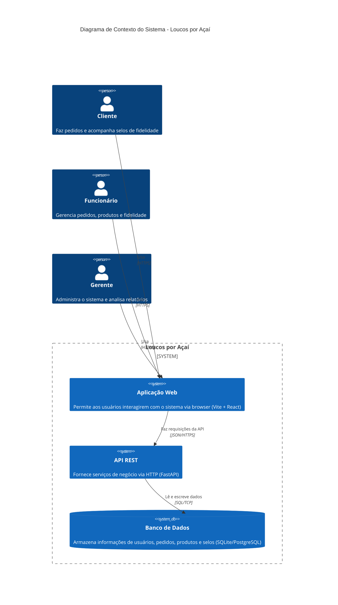
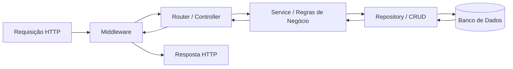
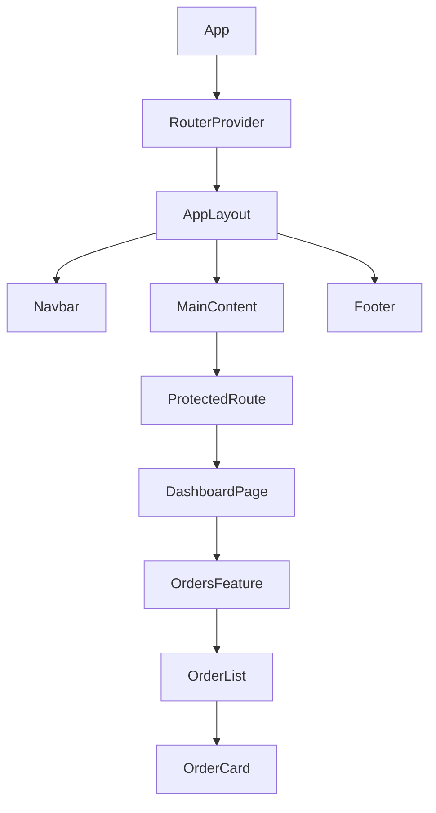
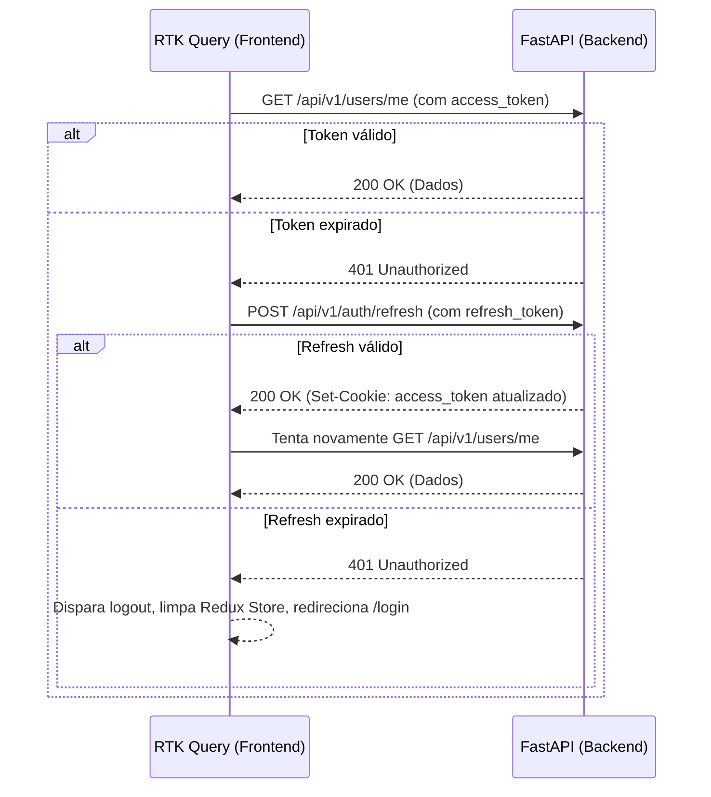
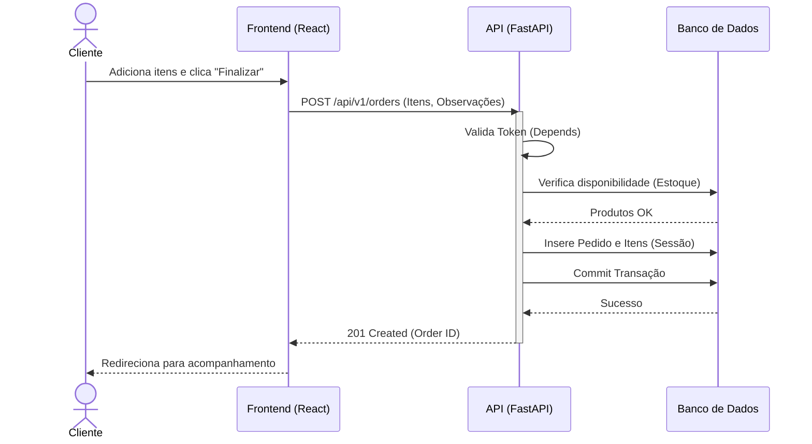
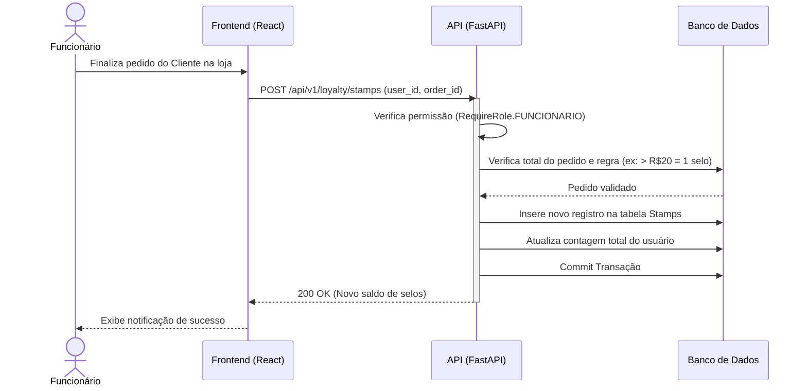
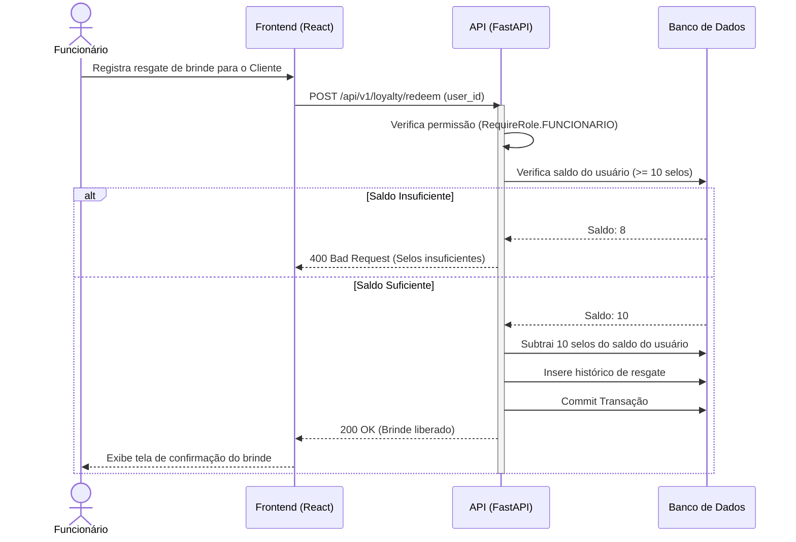

# Documento de Arquitetura: Loucos por Açaí

Este documento descreve a arquitetura de software para o sistema **Loucos por Açaí**, contemplando decisões estruturais do backend, frontend, infraestrutura, segurança e padrões de comunicação.

---

## 1. Visão de Alto Nível

O sistema segue uma arquitetura cliente-servidor padrão utilizando o modelo de _Single Page Application_ (SPA) interagindo com uma API RESTful.



---

## 2. Arquitetura do Backend

O backend é construído utilizando **FastAPI**, **SQLAlchemy 2.0** e **Alembic**, estruturado em camadas claras para promover a separação de responsabilidades e facilitar testes.

### Estrutura de Diretórios (`backend/app/`)

A estrutura segue o padrão de módulos agrupados por domínio ou responsabilidade técnica:

```text
backend/app/
├── api/             # Routers (controladores), divididos por versões (v1) e domínios
├── core/            # Configurações globais (config, security, logger)
├── db/              # Session do banco de dados e funções base
├── models/          # Entidades do banco de dados (SQLAlchemy Models)
├── schemas/         # DTOs (Data Transfer Objects) e validação (Pydantic)
├── services/        # Regras de negócio
├── crud/            # Padrão Repository (acesso a dados genérico)
└── tests/           # Suíte de testes (Pytest)
```

### Ciclo de Vida da Requisição

Cada requisição passa pelas seguintes etapas:



1. **Middleware**: Tratamento de CORS, logging, e possivelmente processamento global de métricas.
2. **Router**: Roteia a requisição, define a dependência (injeção de banco de dados e current user), e mapeia o payload para um Schema (Pydantic).
3. **Service**: Executa a lógica de negócios. Não deve conhecer o contexto HTTP.
4. **Repository (CRUD)**: Camada de persistência que interage com o SQLAlchemy. Utiliza sessões assíncronas (`AsyncSession`).
5. **Database**: A persistência física (SQLite em dev, PostgreSQL em prod).

### Estratégia de Tratamento de Erros

Exceções personalizadas (`HTTPException`) são disparadas na camada de `Service` (ex: `NotFoundError`, `UnauthorizedError`) e capturadas por _exception handlers_ globais definidos no `main.py`. A resposta possui um formato padrão:
```json
{
  "error": "Not Found",
  "message": "User with ID 123 not found"
}
```

### Gerenciamento de Sessão de Banco de Dados

Utilizamos as dependências do FastAPI (`Depends`) para gerenciar as sessões assíncronas do SQLAlchemy. Uma função geradora fornece a `AsyncSession`, garantindo que a sessão seja fechada (ou o rollback executado em caso de erro) no final da requisição.

### Migrações (Alembic)

O controle de versão do esquema do banco de dados é feito pelo Alembic. As migrações são geradas automaticamente baseadas nas alterações dos Models SQLAlchemy.

---

## 3. Arquitetura do Frontend

O frontend utiliza **Vite**, **React 19**, **TypeScript** e **Tailwind CSS**. A organização baseia-se num design por _features_.

### Estrutura de Diretórios (`frontend/src/`)

```text
frontend/src/
├── api/             # Configuração central da API e instâncias do RTK Query
├── assets/          # Arquivos estáticos (imagens, ícones)
├── components/      # Componentes UI reutilizáveis (shadcn/ui), Layouts globais
├── features/        # Módulos isolados por domínio de negócio
│   ├── auth/        # Login, Registro, Formulários, Slices de Auth
│   ├── cart/        # Carrinho de compras (Store, Componentes)
│   ├── orders/      # Gerenciamento de pedidos
│   └── loyalty/     # Sistema de selos
├── hooks/           # Custom React hooks globais
├── pages/           # Rotas principais da aplicação
├── router/          # Configuração do React Router v7
├── store/           # Configuração do Redux Toolkit (root reducer, middlewares)
├── types/           # Definições de tipos TypeScript globais
└── utils/           # Funções utilitárias genéricas
```

### Hierarquia de Componentes



### Estado Global e RTK Query

O estado global é gerenciado pelo **Redux Toolkit**. O _store_ é particionado em _slices_:
- `authSlice`: Estado de autenticação, informações do usuário logado.
- `cartSlice`: Estado do carrinho (adicionar, remover itens localmente).

A comunicação com a API é centralizada via **RTK Query**. APIs são separadas nos módulos de _feature_ e injetadas de forma preguiçosa (_lazy_). Exemplo: `authApi`, `productsApi`, `ordersApi`.

### Formulários e Validação

- Gerenciamento de estado de form: `react-hook-form`.
- Validação: `zod`, com validação assíncrona, sincronizada com o esquema esperado pelo backend.

---

## 4. Comunicação Frontend ↔ Backend

A integração entre frontend e backend é orquestrada pelo RTK Query.

### Fluxo JWT e Refresh Automático

O backend emite dois tokens via cookies httpOnly (`access_token` e `refresh_token`).



### Tratamento de Erros de API

O frontend implementa um middleware no Redux que escuta _rejected actions_ do RTK Query. Falhas de comunicação ou erros `4xx`/`5xx` disparam notificações Toast (da `shadcn/ui`) para informar o usuário.

---

## 5. Segurança

### Arquitetura de Tokens (JWT)
- **Acesso**: _access_token_, validade curta (ex: 15 minutos).
- **Refresh**: _refresh_token_, validade longa (ex: 7 dias).
- Armazenamento em cookies HTTP-Only no domínio correto. Flags: `Secure` (em prod), `HttpOnly=True`, `SameSite='lax'`.
- Impede acesso dos tokens via Javascript (`document.cookie`), mitigando ataques XSS.

### Senhas e Hashing
- Utilização de `bcrypt` via biblioteca `passlib`. Senhas não são trafegadas limpas nos logs e jamais armazenadas em texto pleno.

### Validação de Entrada
- Todas as rotas do FastAPI utilizam schemas `Pydantic` com regras estritas (`maxLength`, `regex`, validação de email) bloqueando _bad payloads_.

### Controle de Acesso Baseado em Papéis (RBAC)
Existem 3 papéis principais:
- `CLIENTE`
- `FUNCIONARIO`
- `GERENTE`
O FastAPI utiliza dependências como `Depends(RequireRole(Role.GERENTE))` para proteger rotas específicas.

---

## 6. Padrões de Design

1. **Repository Pattern (Backend)**: Abstração das chamadas SQL/SQLAlchemy num arquivo de CRUD padrão (ex: `crud.user.get_by_id(db, id)`). Facilita substituição do driver se necessário e isolamento para testes.
2. **Service Layer**: O core da lógica de negócios. Evita roteadores "gordos". O roteador apenas passa DTOs validados para o Service.
3. **DTO Pattern**: Pydantic models para Request e Response. Nunca retornamos o modelo ORM do SQLAlchemy diretamente ao cliente.
4. **Dependency Injection**: Tanto FastAPI (`Depends`) quanto o uso preguiçoso do RTK Query injetando endpoints no baseApi.

---

## 7. Observabilidade

- **Logging**: Módulo padrão de logging do Python integrado ao Uvicorn. Logs de erro detalhados no backend.
- **Monitoring Strategy**: Rotas de `/health` para readiness/liveness probes em orquestradores.

---

## 8. Diagramas de Sequência

### 8.1. Criação de Pedido (Create Order Flow)



### 8.2. Ganho de Selo de Fidelidade (Stamp Earning Flow)



### 8.3. Resgate de Recompensa (Stamp Redemption Flow)


