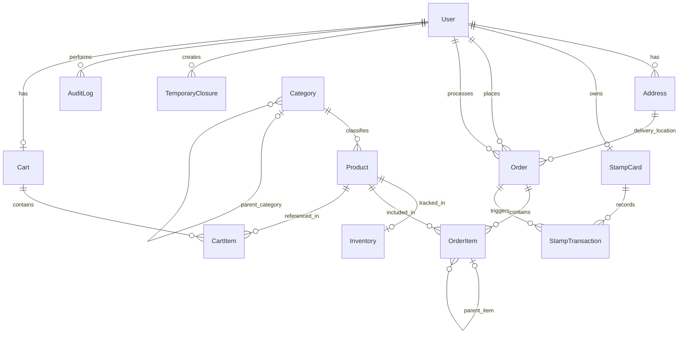
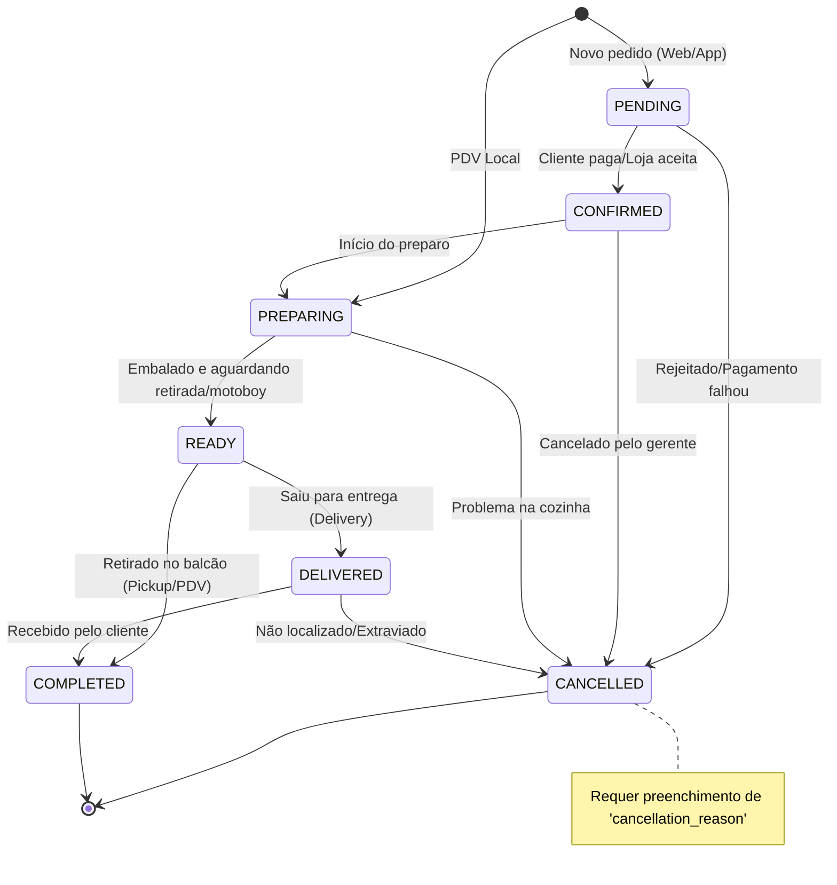

# Modelo de Dados - Loucos por Açaí

Este documento detalha o modelo de dados para o sistema de gestão do **Loucos por Açaí**. A arquitetura utiliza **SQLAlchemy 2.0** como ORM, suportando **SQLite** para desenvolvimento e testes, e **PostgreSQL** para o ambiente de produção.

---

## 1. Diagrama ER Completo

O diagrama a seguir descreve todas as entidades do sistema e seus respectivos relacionamentos:

---

## 2. Entidades

Abaixo estão detalhados os campos, tipos (SQLAlchemy/Python), restrições (Constraints) e descrições para cada uma das entidades mapeadas.

### User

Representa os usuários do sistema, englobando clientes, funcionários e gerentes.

| Field Name             | SQLAlchemy Type                             | Python Type | Constraints                    | Description                                                                                                                                        |
| Field Name             | SQLAlchemy Type                             | Python Type | Constraints                    | Description                                                                                                        |
| ---------------------- | ------------------------------------------- | ----------- | ------------------------------ | ------------------------------------------------------------------------------------------------------------------ |
| `id`                   | `UUID(as_uuid=True)`                        | `uuid.UUID` | PK                             | Identificador único do usuário.                                                                                    |
| `email`                | `String`                                    | `str`       | Unique, Not Null, Index        | E-mail do usuário, usado no login.                                                                                 |
| `hashed_password`      | `String`                                    | `str`       | Not Null                       | Hash da senha para autenticação.                                                                                   |
| `first_name`           | `String(100)`                               | `str`       | -                              | Nome.                                                                                                              |
| `last_name`            | `String(100)`                               | `str`       | -                              | Sobrenome.                                                                                                         |
| `cpf`                  | `String(14)`                                | `str`       | Unique, Not Null, Index        | CPF do usuário. **Obrigatório para todos os tipos de cadastro**, incluindo auto-cadastro online. Formato: 000.000.000-00. |
| `phone`                | `String(20)`                                | `str`       | Nullable                       | Telefone de contato.                                                                                               |
| `role`                 | `Enum('CLIENTE', 'FUNCIONARIO', 'GERENTE')` | `enum`      | Not Null                       | Papel (nível de acesso) do usuário.                                                                                |
| `is_active`            | `Boolean`                                   | `bool`      | Default `True`                 | Flag para ativação/desativação da conta.                                                                           |
| `must_change_password` | `Boolean`                                   | `bool`      | Default `False`                | Força troca de senha no próximo login (usado na migração de dados legados com senhas plain-text).                  |
| `created_at`           | `DateTime(timezone=True)`                   | `datetime`  | Default `func.now()`           | Data e hora de criação.                                                                                            |
| `updated_at`           | `DateTime(timezone=True)`                   | `datetime`  | Default `func.now()`, OnUpdate | Data e hora da última alteração.                                                                                   |

### Address

Endereços associados aos usuários, utilizados principalmente para entrega.

| Field Name     | SQLAlchemy Type      | Python Type | Constraints                   | Description                               |
| -------------- | -------------------- | ----------- | ----------------------------- | ----------------------------------------- |
| `id`           | `UUID(as_uuid=True)` | `uuid.UUID` | PK                            | Identificador único do endereço.          |
| `user_id`      | `UUID(as_uuid=True)` | `uuid.UUID` | FK `User.id`, Not Null, Index | Usuário proprietário do endereço.         |
| `street`       | `String(200)`        | `str`       | Not Null                      | Logradouro.                               |
| `number`       | `String(20)`         | `str`       | Not Null                      | Número da residência.                     |
| `complement`   | `String(100)`        | `str`       | Nullable                      | Complemento (apto, bloco, etc).           |
| `neighborhood` | `String(100)`        | `str`       | Not Null                      | Bairro.                                   |
| `city`         | `String(100)`        | `str`       | Not Null                      | Cidade.                                   |
| `state`        | `String(2)`          | `str`       | Not Null                      | UF (Estado).                              |
| `zip_code`     | `String(9)`          | `str`       | Not Null                      | CEP no formato 00000-000.                 |
| `is_default`   | `Boolean`            | `bool`      | Default `False`               | Indica se é o endereço padrão de entrega. |

### Category

Categorias de produtos, com suporte à hierarquia (subcategorias).

| Field Name      | SQLAlchemy Type      | Python Type | Constraints                | Description                                 |
| --------------- | -------------------- | ----------- | -------------------------- | ------------------------------------------- |
| `id`            | `UUID(as_uuid=True)` | `uuid.UUID` | PK                         | Identificador único da categoria.           |
| `name`          | `String(100)`        | `str`       | Not Null                   | Nome da categoria (ex: Açaí, Complementos). |
| `slug`          | `String(120)`        | `str`       | Unique, Index              | Identificador de URL (SEO amigável).        |
| `description`   | `Text`               | `str`       | Nullable                   | Descrição da categoria.                     |
| `parent_id`     | `UUID(as_uuid=True)` | `uuid.UUID` | FK `Category.id`, Nullable | Auto-relacionamento para hierarquia.        |
| `display_order` | `Integer`            | `int`       | Default `0`                | Ordem de exibição no catálogo.              |
| `is_active`     | `Boolean`            | `bool`      | Default `True`             | Se a categoria está visível/ativa.          |
| `image_url`     | `String`             | `str`       | Nullable                   | URL da imagem representativa.               |

### Product

Produtos disponíveis para venda, como potes de açaí e complementos (toppings).

| Field Name      | SQLAlchemy Type           | Python Type | Constraints                       | Description                                          |
| --------------- | ------------------------- | ----------- | --------------------------------- | ---------------------------------------------------- |
| `id`            | `UUID(as_uuid=True)`      | `uuid.UUID` | PK                                | Identificador único do produto.                      |
| `name`          | `String(200)`             | `str`       | Not Null                          | Nome do produto.                                     |
| `slug`          | `String(220)`             | `str`       | Unique, Index                     | Identificador de URL para o produto.                 |
| `description`   | `Text`                    | `str`       | Nullable                          | Descrição detalhada do produto.                      |
| `price`         | `Numeric(10,2)`           | `Decimal`   | Not Null                          | Preço atual de venda.                                |
| `category_id`   | `UUID(as_uuid=True)`      | `uuid.UUID` | FK `Category.id`, Not Null, Index | Categoria principal associada.                       |
| `image_url`     | `String`                  | `str`       | Nullable                          | URL da foto do produto.                              |
| `is_available`  | `Boolean`                 | `bool`      | Default `True`                    | Se o produto está disponível para venda.             |
| `is_topping`    | `Boolean`                 | `bool`      | Default `False`                   | Identifica se o produto é um complemento.            |
| `is_base`       | `Boolean`                 | `bool`      | Default `False`                   | Identifica se é o produto principal (ex: copo açaí). |
| `tags`          | `String/JSON`             | `str/list`  | Nullable                          | Tags para busca/filtro (JSON Array ou CSV string).   |
| `display_order` | `Integer`                 | `int`       | Default `0`                       | Ordem no menu/PDV.                                   |
| `created_at`    | `DateTime(timezone=True)` | `datetime`  | Default `func.now()`              | Data de registro no sistema.                         |
| `updated_at`    | `DateTime(timezone=True)` | `datetime`  | Default `func.now()`, OnUpdate    | Data de atualização do registro.                     |
| `deleted_at`    | `DateTime(timezone=True)` | `datetime`  | Nullable                          | Controle de _Soft Delete_.                           |

### Inventory

Controle de estoque, com mapeamento 1-para-1 com Product.

| Field Name          | SQLAlchemy Type           | Python Type | Constraints                    | Description                              |
| ------------------- | ------------------------- | ----------- | ------------------------------ | ---------------------------------------- |
| `id`                | `UUID(as_uuid=True)`      | `uuid.UUID` | PK                             | Identificador do registro de estoque.    |
| `product_id`        | `UUID(as_uuid=True)`      | `uuid.UUID` | FK `Product.id`, Unique        | Produto controlado pelo estoque.         |
| `quantity`          | `Integer`                 | `int`       | Not Null, Default `0`          | Quantidade atual.                        |
| `minimum_threshold` | `Integer`                 | `int`       | Not Null, Default `5`          | Limite de alerta para reposição.         |
| `unit`              | `String(20)`              | `str`       | Not Null                       | Unidade de medida (kg, unidade, L, etc). |
| `last_restocked_at` | `DateTime(timezone=True)` | `datetime`  | Nullable                       | Data do último abastecimento de estoque. |
| `updated_at`        | `DateTime(timezone=True)` | `datetime`  | Default `func.now()`, OnUpdate | Data da última alteração.                |

### StampCard (loyalty system)

Cartões fidelidade, limitados a um por cliente.

| Field Name            | SQLAlchemy Type           | Python Type | Constraints                    | Description                               |
| --------------------- | ------------------------- | ----------- | ------------------------------ | ----------------------------------------- |
| `id`                  | `UUID(as_uuid=True)`      | `uuid.UUID` | PK                             | Identificador do cartão.                  |
| `customer_id`         | `UUID(as_uuid=True)`      | `uuid.UUID` | FK `User.id`, Unique           | Cliente proprietário.                     |
| `current_stamps`      | `Integer`                 | `int`       | Default `0`                    | Selos acumulados atuais (não resgatados). |
| `total_stamps_earned` | `Integer`                 | `int`       | Default `0`                    | Histórico total de selos ganhos.          |
| `total_redemptions`   | `Integer`                 | `int`       | Default `0`                    | Quantidade total de resgates realizados.  |
| `created_at`          | `DateTime(timezone=True)` | `datetime`  | Default `func.now()`           | Data de adesão ao programa.               |
| `updated_at`          | `DateTime(timezone=True)` | `datetime`  | Default `func.now()`, OnUpdate | Última modificação de saldo.              |

### StampTransaction

Histórico de ganhos e resgates de selos fidelidade. **Registros são imutáveis** — nunca são deletados. Cancelamentos geram uma nova transação de estorno.

| Field Name                | SQLAlchemy Type                          | Python Type | Constraints                        | Description                                                                  |
| ------------------------- | ---------------------------------------- | ----------- | ---------------------------------- | ---------------------------------------------------------------------------- |
| `id`                      | `UUID(as_uuid=True)`                     | `uuid.UUID` | PK                                 | Identificador da transação.                                                  |
| `stamp_card_id`           | `UUID(as_uuid=True)`                     | `uuid.UUID` | FK `StampCard.id`, Index           | Cartão movimentado.                                                          |
| `type`                    | `Enum('EARNED', 'REDEEMED', 'REVERSED')` | `enum`      | Not Null                           | Tipo de operação: Ganho, Resgate, ou **Estorno** (rollback de cancelamento). |
| `stamps_count`            | `Integer`                                | `int`       | Not Null                           | Selos ganhos ou consumidos (sempre > 0).                                     |
| `order_id`                | `UUID(as_uuid=True)`                     | `uuid.UUID` | FK `Order.id`, Nullable            | Pedido gerador da transação (se houver).                                     |
| `reversed_transaction_id` | `UUID(as_uuid=True)`                     | `uuid.UUID` | FK `StampTransaction.id`, Nullable | Referência à transação estornada (apenas para `type='REVERSED'`).            |
| `discount_amount`         | `Numeric(10,2)`                          | `Decimal`   | Nullable                           | Valor do desconto ao resgatar.                                               |
| `created_at`              | `DateTime(timezone=True)`                | `datetime`  | Default `func.now()`               | Data/hora da transação.                                                      |

> **Regra de Rollback:** Ao cancelar um `Order` com status `PENDING` ou `CONFIRMED`, o `LoyaltyService` deve verificar se existem `StampTransaction` do tipo `EARNED` ou `REDEEMED` vinculadas ao pedido e criar transações de estorno (`REVERSED`) correspondentes, revertendo o saldo de `StampCard.current_stamps`.

### Order

Representa os pedidos dos clientes via delivery/retirada, bem como transações presenciais de PDV.

| Field Name            | SQLAlchemy Type           | Python Type | Constraints                    | Description                                   |
| --------------------- | ------------------------- | ----------- | ------------------------------ | --------------------------------------------- |
| `id`                  | `UUID(as_uuid=True)`      | `uuid.UUID` | PK                             | Identificador único do pedido.                |
| `order_number`        | `String`                  | `str`       | Unique, Not Null, Index        | Número legível (ex: LPA-20260719-0001).       |
| `customer_id`         | `UUID(as_uuid=True)`      | `uuid.UUID` | FK `User.id`, Index            | Cliente que realizou o pedido.                |
| `employee_id`         | `UUID(as_uuid=True)`      | `uuid.UUID` | FK `User.id`, Nullable         | Funcionário responsável pelo PDV/atendimento. |
| `status`              | `Enum(...)`               | `enum`      | Not Null                       | Ver sessão de _Status do Pedido_ abaixo.      |
| `order_type`          | `Enum(...)`               | `enum`      | Not Null                       | Origem (ONLINE_PICKUP, ONLINE_DELIVERY, POS). |
| `subtotal`            | `Numeric(10,2)`           | `Decimal`   | Not Null                       | Somatório dos itens.                          |
| `discount`            | `Numeric(10,2)`           | `Decimal`   | Default `0.00`                 | Descontos (ex: cartão fidelidade).            |
| `total`               | `Numeric(10,2)`           | `Decimal`   | Not Null                       | Valor final pago (subtotal - discount).       |
| `notes`               | `Text`                    | `str`       | Nullable                       | Observações do pedido.                        |
| `delivery_address_id` | `UUID(as_uuid=True)`      | `uuid.UUID` | FK `Address.id`, Nullable      | Endereço de destino (Delivery).               |
| `estimated_ready_at`  | `DateTime(timezone=True)` | `datetime`  | Nullable                       | Previsão de entrega/disponibilidade.          |
| `completed_at`        | `DateTime(timezone=True)` | `datetime`  | Nullable                       | Quando entregue/retirado com sucesso.         |
| `cancelled_at`        | `DateTime(timezone=True)` | `datetime`  | Nullable                       | Data de cancelamento (se houver).             |
| `cancellation_reason` | `Text`                    | `str`       | Nullable                       | Motivo do cancelamento.                       |
| `created_at`          | `DateTime(timezone=True)` | `datetime`  | Default `func.now()`           | Entrada do pedido.                            |
| `updated_at`          | `DateTime(timezone=True)` | `datetime`  | Default `func.now()`, OnUpdate | Atualização do registro.                      |

### OrderItem

Itens presentes no pedido. Suporta o relacionamento hierárquico para complementos (toppings) anexados a uma base.

| Field Name       | SQLAlchemy Type      | Python Type | Constraints                    | Description                                 |
| ---------------- | -------------------- | ----------- | ------------------------------ | ------------------------------------------- |
| `id`             | `UUID(as_uuid=True)` | `uuid.UUID` | PK                             | Identificador do item no pedido.            |
| `order_id`       | `UUID(as_uuid=True)` | `uuid.UUID` | FK `Order.id`, Not Null, Index | Pedido proprietário do item.                |
| `product_id`     | `UUID(as_uuid=True)` | `uuid.UUID` | FK `Product.id`, Not Null      | Produto comercializado.                     |
| `quantity`       | `Integer`            | `int`       | Not Null, Default `1`          | Quantidade.                                 |
| `unit_price`     | `Numeric(10,2)`      | `Decimal`   | Not Null                       | Preço unitário no momento do pedido.        |
| `subtotal`       | `Numeric(10,2)`      | `Decimal`   | Not Null                       | quantity \* unit_price.                     |
| `notes`          | `Text`               | `str`       | Nullable                       | Observação do item (ex: "Sem granulado").   |
| `parent_item_id` | `UUID(as_uuid=True)` | `uuid.UUID` | FK `OrderItem.id`, Nullable    | Vincula complementos a um item base (Açaí). |

### Cart

Carrinho de compras persistido por usuário (um por usuário). Expira automaticamente após inatividade.

| Field Name   | SQLAlchemy Type           | Python Type | Constraints                    | Description                                                                                                                  |
| ------------ | ------------------------- | ----------- | ------------------------------ | ---------------------------------------------------------------------------------------------------------------------------- |
| `id`         | `UUID(as_uuid=True)`      | `uuid.UUID` | PK                             | Identificador único do carrinho.                                                                                             |
| `user_id`    | `UUID(as_uuid=True)`      | `uuid.UUID` | FK `User.id`, Unique           | Usuário proprietário (1 carrinho por usuário).                                                                               |
| `expires_at` | `DateTime(timezone=True)` | `datetime`  | Not Null                       | Expiração do carrinho (ex: 24h após última interação). Itens não são removidos automaticamente; o Service valida na leitura. |
| `created_at` | `DateTime(timezone=True)` | `datetime`  | Default `func.now()`           | Data de criação.                                                                                                             |
| `updated_at` | `DateTime(timezone=True)` | `datetime`  | Default `func.now()`, OnUpdate | Última modificação (atualizar ao adicionar/remover itens).                                                                   |

### CartItem

Itens individuais dentro do carrinho.

| Field Name         | SQLAlchemy Type      | Python Type  | Constraints                   | Description                                         |
| ------------------ | -------------------- | ------------ | ----------------------------- | --------------------------------------------------- |
| `id`               | `UUID(as_uuid=True)` | `uuid.UUID`  | PK                            | Identificador do item no carrinho.                  |
| `cart_id`          | `UUID(as_uuid=True)` | `uuid.UUID`  | FK `Cart.id`, Not Null, Index | Carrinho proprietário.                              |
| `product_id`       | `UUID(as_uuid=True)` | `uuid.UUID`  | FK `Product.id`, Not Null     | Produto adicionado.                                 |
| `quantity`         | `Integer`            | `int`        | Not Null, Default `1`         | Quantidade.                                         |
| `unit_price`       | `Numeric(10,2)`      | `Decimal`    | Not Null                      | Preço unitário no momento da adição (snapshot).     |
| `options_selected` | `JSON`               | `list[uuid]` | Nullable                      | Lista de UUIDs de opções/complementos selecionados. |
| `notes`            | `Text`               | `str`        | Nullable                      | Observações do item (ex: "Sem granulado").          |

> **Estratégia de Concorrência no Checkout:** Ao converter o Cart em Order, o `OrderService` deve adquirir um lock de nível de aplicação (via flag de processamento no Cart ou transação serializada) ao deduzir estoque em `Inventory`, garantindo que a operação seja atômica. O SQLite já serializa escritas por padrão (WAL mode), o que mitiga race conditions em volumes baixos — adequado para o escopo atual do projeto.

### BusinessHours

Horários de funcionamento regulares do estabelecimento.

| Field Name     | SQLAlchemy Type      | Python Type | Constraints     | Description                                                                                                         |
| -------------- | -------------------- | ----------- | --------------- | ------------------------------------------------------------------------------------------------------------------- |
| `id`           | `UUID(as_uuid=True)` | `uuid.UUID` | PK              | Identificador da regra de horário.                                                                                  |
| `day_of_week`  | `Integer`            | `int`       | Not Null        | **0 = Segunda-feira, 6 = Domingo** (padrão ISO 8601-like). Consistente com os dados de seed (0-5: Seg–Sáb, 6: Dom). |
| `opening_time` | `Time`               | `time`      | Nullable        | Hora de abertura.                                                                                                   |
| `closing_time` | `Time`               | `time`      | Nullable        | Hora de fechamento.                                                                                                 |
| `is_closed`    | `Boolean`            | `bool`      | Default `False` | Indica se não há expediente no dia.                                                                                 |

### Holiday

Feriados e datas especiais.

| Field Name    | SQLAlchemy Type      | Python Type | Constraints      | Description                          |
| ------------- | -------------------- | ----------- | ---------------- | ------------------------------------ |
| `id`          | `UUID(as_uuid=True)` | `uuid.UUID` | PK               | Identificador do feriado.            |
| `date`        | `Date`               | `date`      | Unique, Not Null | Data do feriado.                     |
| `description` | `String(200)`        | `str`       | Not Null         | Descrição/Nome (ex: "Natal").        |
| `is_closed`   | `Boolean`            | `bool`      | Default `True`   | Se o comércio estará fechado no dia. |

### TemporaryClosure

Fechamento emergencial ou temporário.

| Field Name       | SQLAlchemy Type           | Python Type | Constraints            | Description                      |
| ---------------- | ------------------------- | ----------- | ---------------------- | -------------------------------- |
| `id`             | `UUID(as_uuid=True)`      | `uuid.UUID` | PK                     | Identificador do evento.         |
| `start_datetime` | `DateTime(timezone=True)` | `datetime`  | Not Null               | Início do período de fechamento. |
| `end_datetime`   | `DateTime(timezone=True)` | `datetime`  | Not Null               | Previsão de reabertura.          |
| `reason`         | `String(500)`             | `str`       | Not Null               | Justificativa do fechamento.     |
| `created_by_id`  | `UUID(as_uuid=True)`      | `uuid.UUID` | FK `User.id`, Not Null | Usuário (Gerente) que cadastrou. |

### AuditLog

Registro de ações importantes (histórico/rastreabilidade).

| Field Name    | SQLAlchemy Type           | Python Type | Constraints            | Description                                    |
| ------------- | ------------------------- | ----------- | ---------------------- | ---------------------------------------------- |
| `id`          | `UUID(as_uuid=True)`      | `uuid.UUID` | PK                     | Identificador do log.                          |
| `user_id`     | `UUID(as_uuid=True)`      | `uuid.UUID` | FK `User.id`, Nullable | Usuário que executou a ação (se aplicável).    |
| `action`      | `String(50)`              | `str`       | Not Null, Index        | Ação (ex: CREATE, UPDATE, DELETE).             |
| `entity_type` | `String(50)`              | `str`       | Not Null, Index        | Tabela afetada (ex: 'Product', 'Order').       |
| `entity_id`   | `String(50)`              | `str`       | Not Null, Index        | ID do registro afetado (convertido em string). |
| `old_values`  | `JSON/JSONB`              | `dict`      | Nullable               | Snapshot dos dados antes da alteração.         |
| `new_values`  | `JSON/JSONB`              | `dict`      | Nullable               | Snapshot dos dados após a alteração.           |
| `ip_address`  | `String(45)`              | `str`       | Nullable               | IP que originou a requisição.                  |
| `created_at`  | `DateTime(timezone=True)` | `datetime`  | Default `func.now()`   | Instante da operação.                          |

---

## 3. Índices

Para garantir ótima performance em consultas críticas do banco de dados, os seguintes índices explícitos serão aplicados na criação da estrutura (além dos implícitos em Foreign Keys e Uniques):

1. **User**: `(email)` e `(cpf)` (buscas de login/cadastro rápido).
2. **Category**: `(slug, is_active)` para listar vitrine de categorias.
3. **Product**: `(category_id, is_available)`, e `(slug)`. Para vitrine, indexar filtragem por categorias ativas.
4. **Order**:
   - `(customer_id, created_at DESC)` (Histórico de pedidos do cliente).
   - `(status, created_at)` (Painel/Dashboard do PDV).
   - `(order_number)`.
5. **AuditLog**: `(entity_type, entity_id)` para rastrear modificações de um registro específico, além de `(created_at DESC)` para listagem temporal.

---

## 4. Constraints (Restrições Customizadas)

Além de Primary Keys (PKs), Foreign Keys (FKs), NOT NULL e UNIQUE, estas regras de Check serão implementadas (por meio de `CheckConstraint` no SQLAlchemy):

1. **User.cpf**: Verificar através da aplicação (e uma constraint via regex rudimentar no DB) se os formatos correspondem, porém a validação real será em nível de aplicação (Pydantic/Business Logic).
2. **Order.total_vs_subtotal**: Garantir matematicamente na aplicação, e opcionalmente no banco, que `total = subtotal - discount` e que total nunca seja menor que zero (`CHECK (total >= 0)`).
3. **Inventory.quantity**: Não pode ser negativa, caso não se venda estoque que não existe (`CHECK (quantity >= 0)`).
4. **Product.price**: Não pode ser um valor negativo (`CHECK (price >= 0)`).
5. **BusinessHours.day_of_week**: Apenas valores de 0 a 6 (`CHECK (day_of_week >= 0 AND day_of_week <= 6)`).
6. **StampTransaction.stamps_count**: Precisa ser estritamente positivo (`CHECK (stamps_count > 0)`).

---

## 5. Soft Delete Strategy

A entidade `Product` implementará **Soft Delete** (exclusão lógica).

**Motivação:**
Excluir um produto de forma definitiva geraria violação de integridade em tabelas filhas essenciais (ex: `OrderItem`, `Inventory`). Não é viável "anular" (SET NULL) essas relações ou usar deleção em cascata para um histórico de vendas (que distorceria relatórios financeiros).

**Implementação Técnica (SQLAlchemy):**

1. Existirá a coluna `deleted_at: DateTime(timezone=True)`.
2. O ORM irá possuir um _Custom Base/Query Class_ ou métodos explícitos para filtrar resultados válidos: `query.filter(Product.deleted_at.is_(None))`.
3. Uma ação de exclusão na API realizará na verdade um update: `SET deleted_at = CURRENT_TIMESTAMP`.
4. Nas chaves estrangeiras onde os produtos já foram comprados (`OrderItem.product_id`), os dados de relacionamento continuarão íntegros e as queries do histórico continuarão exibindo a descrição dos produtos (ainda que inativos/deletados do catálogo público).

---

## 6. Seed Data (Carga Inicial)

Um script de _seeding_ será desenvolvido (ex: `scripts/seed.py`) gerando o estado inicial do sistema no ambiente.

1. **Super Admin / Gerente**:
   - Um usuário inicial (ex: `admin@loucosporacai.com`) com cargo `GERENTE`.
2. **Business Hours**:
   - Seg a Sáb (0-5): Abertura às 13:00, Fechamento às 22:00.
   - Domingo (6): `is_closed=True`.
3. **Categories Iniciais**:
   - Açaí Base
   - Adicionais/Complementos (toppings)
   - Bebidas
4. **Produtos Iniciais** (com inventário vinculado se necessário):
   - Açaí 300ml, 500ml, 700ml (Marcados com `is_base=True`).
   - Leite em Pó, Granulado, Leite Condensado, Paçoca (Marcados com `is_topping=True`).

---

## 7. Migration Strategy

A migração de dados do banco de dados antigo (Django/SQLite) para o novo formato (SQLAlchemy 2.0 / PostgreSQL) ocorrerá por meio de scripts ETL construídos em Python.

**Passos:**

1. **Alembic:** Todo o novo schema será gerido pelo [Alembic](https://alembic.sqlalchemy.org/), gerando os scripts de DDL (criação de tabelas e constraints).
2. **Script ETL Python (Extract, Transform, Load)**:
   - Conectar-se simultaneamente ao `db.sqlite3` antigo via SQLAlchemy core (usando as tabelas espelhadas ou RAW SQL) e ao PostgreSQL de produção.
   - Mapear a transposição de dados e UUIDs. IDs antigos (provavelmente inteiros incrementais no Django) podem ser convertidos gerando UUIDs determinísticos (`uuid.uuid5()`) baseados em namespace e ID legado, ou gerando chaves novas e mantendo um dicionário temporário de mapeamento de relação, caso necessário.
   - **User**: Será necessário transformar hashes (ex: se o Django usava PBKDF2 ou Argon2, o AuthProvider do novo sistema deve suportar validar senhas de hashes Django antigos, ou deve haver um reset forçado).
   - **Order History**: Transformar e normalizar a nomenclatura dos status das ordens do modelo legado para o novo enum de status.
3. **Validação de Data Integrity**: Após o _Load_, um script de conferência vai testar os quantitativos das ordens antigas versus faturamento exportado do Django para garantir que não houveram perdas (ex: batimento de subtotal e total).

---

## 8. Diagrama de Estados - Ciclo de Vida do Pedido (Order)

O fluxo (State Diagram) a seguir ilustra a transição dos possíveis estados em que a entidade `Order.status` pode estar e as ações operacionais correspondentes:

