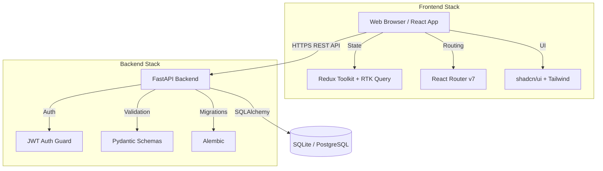
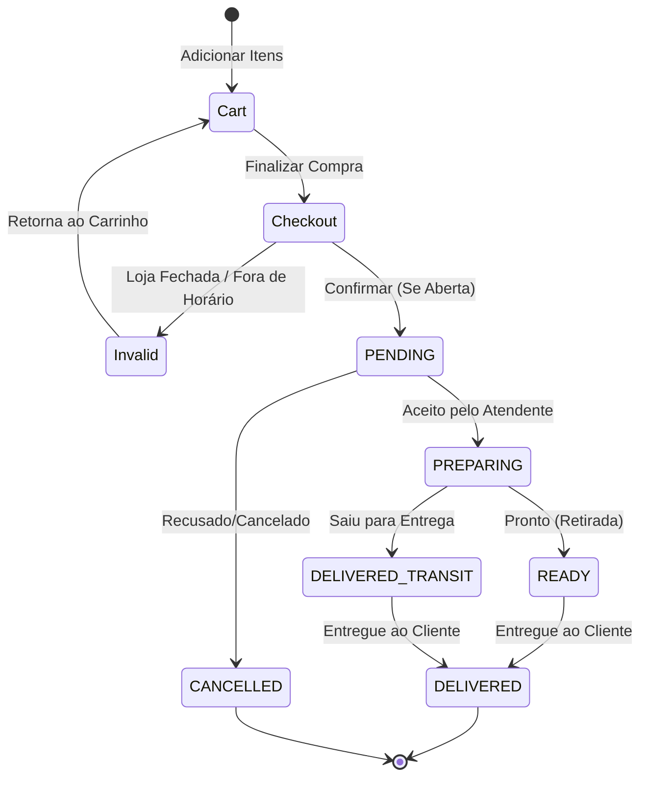

# Documento de Arquitetura e Design: Loucos por Açaí (v2)

Este documento descreve a arquitetura, stack tecnológica, modelagem de dados e decisões de design para a reescrita completa do sistema de gestão da açaiteria "Loucos por Açaí".

## 1. Visão Geral do Sistema

O sistema "Loucos por Açaí" original possuía falhas críticas arquiteturais (como a deleção do estoque ao finalizar vendas e a falta de criptografia de senhas). A versão 2.0 visa não apenas corrigir essas falhas através de uma arquitetura robusta e moderna, mas também expandir as capacidades do negócio.

**Objetivos Principais:**
- **Segurança e Estabilidade**: Criptografia de senhas (Argon2/Bcrypt), uso seguro de JWT via cookies `httpOnly`, transações atômicas no banco de dados.
- **Experiência do Usuário (UI/UX)**: Interface premium, baseada na temática do Açaí (Roxo, Magenta e Dourado), utilizando React e componentes acessíveis.
- **Novas Funcionalidades**: Sistema de pedidos online ("Monte seu Açaí"), novo sistema de fidelidade baseado em selos, controle dinâmico de horário de funcionamento e relatórios gerenciais em PDF/Excel.

---

## 2. Stack Tecnológica

### Backend
- **Framework**: FastAPI (Alta performance, tipagem forte, auto-geração de documentação Swagger/OpenAPI).
- **ORM**: SQLAlchemy 2.0 (Gerenciamento robusto de banco de dados e transações).
- **Migrações**: Alembic.
- **Banco de Dados**: SQLite para desenvolvimento local; estruturado para migração fácil para PostgreSQL em produção.
- **Autenticação**: JSON Web Tokens (JWT) com Access e Refresh tokens.
- **Testes**: `pytest`.
- **Gerenciador de Dependências**: Poetry (`pyproject.toml`).

### Frontend
- **Framework**: React 18+ com TypeScript.
- **Build Tool**: Vite (Alta velocidade de HMR e build).
- **Roteamento**: React Router v7.
- **Gerenciamento de Estado**: Redux Toolkit (estado global) + RTK Query (cache e chamadas de API).
- **UI Library**: shadcn/ui + Tailwind CSS.
- **Testes**: Vitest + React Testing Library.

### Integração e Padrões
- **Comunicação**: REST API com versionamento explícito (`/api/v1/`).
- **Linguagem do Código**: Inglês (variáveis, funções, classes).
- **Linguagem da UI**: Português (PT-BR).
- **Estrutura**: Monorepo "Flat" com pastas isoladas para backend e frontend.

---

## 3. Arquitetura do Sistema

O sistema segue a arquitetura Cliente-Servidor (Client-Server), com separação estrita de responsabilidades. O frontend atua como um Single Page Application (SPA) que se comunica com o backend exclusivamente via API REST.



---

## 4. Estrutura do Monorepo

O projeto utilizará uma estrutura de monorepo simplificada:

```text
/Loucos-por-acai
├── backend/
│   ├── alembic/              # Arquivos de migração do banco
│   ├── app/
│   │   ├── api/              # Rotas da API (v1)
│   │   ├── core/             # Configurações globais, segurança, JWT
│   │   ├── crud/             # Lógica de acesso a dados
│   │   ├── models/           # Modelos SQLAlchemy
│   │   ├── schemas/          # Modelos Pydantic (Validação in/out)
│   │   └── services/         # Lógica de negócios complexa
│   ├── tests/                # Testes com pytest
│   ├── pyproject.toml        # Configuração do Poetry
│   └── alembic.ini
│
├── frontend/
│   ├── public/
│   ├── src/
│   │   ├── app/              # Configuração do Redux Store
│   │   ├── assets/           # Imagens, fontes
│   │   ├── components/       # Componentes reutilizáveis (shadcn)
│   │   ├── features/         # Slices do Redux e RTK Query endpoints
│   │   ├── hooks/            # Custom React hooks
│   │   ├── pages/            # View components por rota
│   │   ├── types/            # Definições de tipos globais
│   │   └── utils/            # Funções utilitárias e constantes
│   ├── package.json
│   ├── tailwind.config.js
│   └── vite.config.ts
│
└── docs/
    └── DESIGN.md             # Este documento
```

---

## 5. Modelagem de Dados (ERD)

A modelagem reflete a separação correta entre produtos de menu, estoque, carrinhos e pedidos. Isso resolve o bug crítico do sistema antigo que confundia a quantidade de estoque com a quantidade do carrinho.

```mermaid
erDiagram
    User {
        int id PK
        string email UK
        string password_hash
        string full_name
        string phone
        string role "CLIENTE, FUNCIONARIO, GERENTE"
        boolean is_active
        datetime created_at
    }

    Category {
        int id PK
        string name
        int parent_id FK "Nullable, self-referencing"
    }

    Product {
        int id PK
        int category_id FK
        string name
        string description
        decimal price
        int stock_quantity
        int min_stock_threshold
        string image_url
        boolean is_active
        datetime created_at
    }

    Order {
        int id PK
        int user_id FK
        string status "PENDING, PREPARING, READY, DELIVERED, CANCELLED"
        string order_type "DELIVERY, PICKUP, IN_STORE"
        decimal total_amount
        string delivery_address "Nullable"
        datetime created_at
    }

    OrderItem {
        int id PK
        int order_id FK
        int product_id FK
        int quantity
        decimal unit_price
        string notes
    }

    Cart {
        int id PK
        int user_id FK
        datetime updated_at
    }

    CartItem {
        int id PK
        int cart_id FK
        int product_id FK
        int quantity
        decimal unit_price
    }

    LoyaltyCard {
        int id PK
        int user_id FK UK
        int current_stamps
        int total_stamps_earned
    }

    BusinessHours {
        int id PK
        int day_of_week "0=Sunday to 6=Saturday"
        time open_time
        time close_time
        boolean is_closed
    }
    
    StoreConfig {
        int id PK
        boolean temporary_closure
        string closure_reason
    }

    User ||--o{ Order : places
    User ||--o| Cart : has
    User ||--o| LoyaltyCard : owns
    Category ||--o{ Product : contains
    Category ||--o{ Category : parent_child
    Order ||--|{ OrderItem : includes
    Product ||--o{ OrderItem : referenced_in
    Cart ||--|{ CartItem : contains
    Product ||--o{ CartItem : referenced_in
```

---

## 6. API Endpoints (v1)

A API seguirá o padrão REST, com respostas em JSON padronizadas.

### Auth (`/api/v1/auth`)
- `POST /login`: Recebe credenciais, retorna e seta cookies httpOnly com Access e Refresh tokens.
- `POST /logout`: Invalida tokens e limpa cookies.
- `POST /refresh`: Gera novo Access token usando o Refresh token válido.
- `GET /me`: Retorna os dados do usuário autenticado atual.

### Users (`/api/v1/users`)
- `GET /`: Lista usuários (GERENTE apenas).
- `POST /`: Cria novo usuário (registro de clientes ou criação por gerentes).
- `GET /{id}`: Detalhes de um usuário.
- `PATCH /{id}`: Atualiza usuário.

### Products & Categories (`/api/v1/catalog`)
- `GET /categories`: Lista categorias (hierárquicas).
- `POST /categories`: Cria categoria (GERENTE).
- `GET /products`: Lista produtos (filtros: categoria, ativo). Rota pública.
- `POST /products`: Cria produto (GERENTE).
- `PATCH /products/{id}`: Atualiza produto/estoque (FUNCIONARIO/GERENTE).

### Orders & Cart (`/api/v1/orders` / `/api/v1/cart`)
- `GET /cart`: Retorna o carrinho do usuário atual.
- `POST /cart/items`: Adiciona item ao carrinho.
- `PATCH /cart/items/{id}`: Atualiza quantidade.
- `DELETE /cart/items/{id}`: Remove item.
- `POST /orders`: Converte carrinho em pedido (Checkout).
- `GET /orders`: Lista pedidos do usuário (ou todos se FUNCIONARIO/GERENTE).
- `PATCH /orders/{id}/status`: Atualiza o status do pedido (FUNCIONARIO/GERENTE).

### Loyalty (`/api/v1/loyalty`)
- `GET /`: Retorna o cartão de fidelidade do usuário logado.
- `POST /redeem`: Usa 10 selos para gerar desconto no carrinho ativo.
- `POST /add_stamp`: Adiciona selos a um usuário após uma compra in-store (FUNCIONARIO/GERENTE).

### Business Config (`/api/v1/config`)
- `GET /hours`: Retorna horário de funcionamento atual e status (Aberto/Fechado). Rota pública.
- `PATCH /hours`: Atualiza horários e toggles de fechamento (GERENTE).

---

## 7. Autenticação e Autorização

**Fluxo de JWT:**
1. Login bem-sucedido gera um `access_token` (curta duração, ex: 15 min) e um `refresh_token` (longa duração, ex: 7 dias).
2. Ambos os tokens são enviados como cookies `httpOnly`, `Secure` (em prod) e `SameSite=Lax`.
3. O Frontend não acessa os tokens pelo JS, mitigando ataques XSS. Requisições à API incluem os cookies automaticamente.

**RBAC (Role-Based Access Control):**
Três papéis (Roles) bem definidos:
- **CLIENTE**: Pode ver produtos ativos, gerenciar próprio carrinho, criar pedidos, ver próprio histórico e selos de fidelidade.
- **FUNCIONARIO**: Permissões do cliente + acesso ao PDV (Vendas in-store), visualização de todos os pedidos e clientes, atualização de status de pedidos e estoque básico.
- **GERENTE**: Permissões de funcionário + CRUD de funcionários, CRUD de produtos e categorias, alteração de horário de funcionamento e acesso aos relatórios gerenciais/dashboard.

---

## 8. Funcionalidades por Módulo

- **Catálogo Público**: Visível sem login. Mostra categorias, produtos, preços, descrições e fotos. O botão "Pedir" exige login.
- **Monte seu Açaí**: Interface step-by-step.
  1. Escolher Base (Tamanhos).
  2. Adicionar Complementos (Frutas, Grãos, etc).
  3. Adicionar Caldas.
  4. O frontend calcula dinamicamente `total = base + sum(complementos) + sum(caldas)`.
- **PDV (Ponto de Venda)**: Interface rápida para funcionários registrarem vendas balcão. Atualiza estoque no banco e insere selos no CPF do cliente, se informado.
- **Estoque**: Notificações e badge visual no painel do Gerente quando produtos atingem `min_stock_threshold`.
- **Relatórios**: Dashboard com gráficos (vendas por dia, top 5 produtos) consumindo endpoints analíticos. Exportação usando bibliotecas como `pdfmake` ou `SheetJS` no frontend (ou gerados no backend).

---

## 9. Sistema de Fidelidade (Selos)

O antigo sistema baseado em pontos será substituído por "Selos", que são mais fáceis de comunicar aos clientes.
- **Regra de Acúmulo**: A cada R$ 20,00 gastos no mesmo pedido, o cliente ganha 1 selo (Ex: R$ 45,00 = 2 selos).
- **Regra de Resgate**: Ao acumular 10 selos, o cliente ganha um desconto fixo de R$ 20,00 na próxima compra.
- O resgate deduz 10 selos do `current_stamps` e aplica uma flag/desconto no backend durante o Checkout.

---

## 10. Fluxo de Pedidos Online

O sistema deve verificar o horário de funcionamento antes de permitir o checkout.



---

## 11. Horário de Funcionamento

O Gerente possui um painel de configuração para a loja:
- **Tabela Semanal**: Define `open_time` e `close_time` ou flag de `is_closed` para cada dia (Domingo a Sábado).
- **Fechamento Temporário**: Um "Kill Switch" de um clique para fechar a loja imediatamente por imprevistos (ex: falta de energia). Exibe o `closure_reason` no frontend público.
- O Backend intercepta rotas de criação de pedido validando `datetime.now()` contra a tabela de horários.

---

## 12. Design System

- **Tema e Cores**:
  - **Primária**: Roxo Escuro Açaí (ex: Tailwind `purple-900` / `#4c1d95`).
  - **Secundária**: Magenta (ex: Tailwind `fuchsia-600` / `#c026d3`).
  - **Destaque / Ação**: Dourado / Amarelo (ex: Tailwind `amber-400` / `#fbbf24`).
  - **Fundo**: Modo claro focado em tons pastéis (creme/branco) ou dark mode nativo usando o suporte do shadcn/ui.
- **Tipografia**: Sans-serif moderna e legível (ex: Inter ou Poppins para cabeçalhos).
- **Componentes**: Utilização extensiva de `shadcn/ui` para garantir acessibilidade e consistência visual, com customização do arquivo `globals.css` para injetar os tons de roxo.

---

## 13. Migração de Dados

Para evitar a perda de dados dos clientes (cadastros atuais) ao migrar do antigo banco SQLite:
1. Um script em Python (`scripts/migrate_legacy.py`) deve ler o antigo banco de dados.
2. Migrar contas de usuários (requer redefinição de senhas, visto que as antigas estavam em plain-text. Todos receberão uma flag `must_change_password`).
3. Migrar o histórico de vendas para a nova estrutura de `Order` e `OrderItem`.
4. Os pontos antigos de fidelidade serão convertidos proporcionalmente em selos (ex: antigo 100 pontos = X selos).

---
*Fim do Documento de Especificação.*
