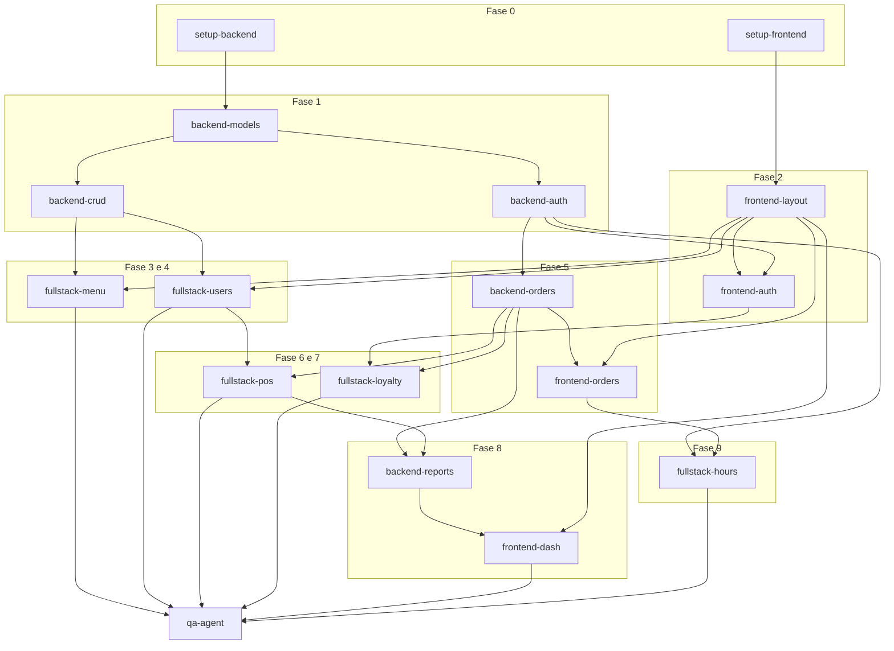

# Plano de Implementação: Loucos por Açaí (v2.0)

Este documento descreve o plano detalhado de implementação para a reescrita do sistema de gerenciamento "Loucos por Açaí", utilizando uma arquitetura moderna (FastAPI + React/TypeScript) em um monorepo. O plano foi estruturado para suportar a orquestração de subagentes autônomos, permitindo trabalho paralelo onde possível e estabelecendo dependências claras.

## 1. Visão Geral

O projeto consiste na reformulação completa do sistema "Loucos por Açaí", substituindo a versão atual por uma solução robusta, escalável e tipada de ponta a ponta. 

**Stack Tecnológico:**
*   **Backend:** FastAPI, SQLAlchemy 2.0, Alembic, Poetry, SQLite.
*   **Frontend:** React, TypeScript, Vite, shadcn/ui, Tailwind CSS, Redux Toolkit, RTK Query.
*   **Segurança:** JWT (httpOnly cookies), RBAC (CLIENTE, FUNCIONARIO, GERENTE).
*   **Estrutura:** Monorepo (`backend/` + `frontend/`).

**Esforço Estimado:** Aproximadamente 12 a 16 semanas para uma equipe pequena ou execução de agentes, dividido em 11 fases distintas (Fase 0 a Fase 10).

---

## 2. Fases de Implementação

### Fase 0: Setup do Projeto (Foundation)
*   Inicializar a estrutura básica do monorepo (`backend/` e `frontend/`).
*   **Backend:** Configurar Poetry, dependências base do FastAPI, estrutura de pastas, configuração do banco de dados (**SQLite**) e Alembic para migrações.
*   **Frontend:** Inicializar Vite + React + TypeScript, instalar Tailwind CSS e shadcn/ui.
*   Configurar Redux Store (boilerplate básico).
*   Configurar ferramentas de qualidade: ESLint, Prettier, pytest, Vitest.

### Fase 1: Core Backend (Auth + Models + Base API)
*   Implementar todos os modelos do SQLAlchemy (Usuários, Produtos, Categorias, Pedidos, Itens, Estoque, Cart/CartItem, Cartão Fidelidade, etc.) conforme `DATA_MODEL.md`.
*   Criar a primeira migração do Alembic.
*   Implementar autenticação JWT completa (login, registro, refresh token, logout com httpOnly cookies).
*   Implementar middleware/dependências para RBAC (Role-Based Access Control).
*   **Segurança:** Configurar rate limiting com `slowapi` nos endpoints de autenticação (`/auth/login`, `/auth/register`, `/auth/refresh`) — ex: max 10 req/min por IP. Isso é um requisito de segurança não-negociável, não um enhancement futuro.
*   Implementar endpoints CRUD básicos para Usuários (Clientes, Funcionários, Gerentes).
*   Implementar endpoints CRUD para Categorias e Produtos, e gerenciamento de Estoque.
*   Escrever testes unitários (pytest) para auth e modelos.

### Fase 2: Core Frontend (Auth + Layout + Navigation)
*   Implementar páginas de autenticação (Login, Registro).
*   Desenvolver o layout principal (Sidebar, Header, navegação baseada em papéis - RBAC).
*   Implementar o Slice de Autenticação no Redux e os endpoints de auth via RTK Query.
*   Configurar rotas protegidas (`ProtectedRoute`).
*   Criar estrutura das páginas públicas (Home, Menu, Sobre, Contato).
*   Configurar o tema do shadcn/ui (paleta de cores roxa/açaí).

### Fase 3: Product & Menu System
*   **Backend:** Refinar API de Produtos e Categorias (paginação, filtros). Implementar upload/gerenciamento de imagens.
*   **Frontend (Público):** Desenvolver a página visual do Cardápio (categorias, listagem de produtos com imagens).
*   **Frontend (Admin):** Desenvolver as telas de gerenciamento (CRUD) de Produtos e Categorias.

### Fase 4: Customer & Employee Management
*   **Backend:** Refinar endpoints específicos para Clientes e Funcionários.
*   **Frontend (Admin):** Páginas de listagem, criação, edição e exclusão de Clientes e Funcionários.
*   **Frontend (Cliente):** Página de Perfil do Cliente (visualização e edição de dados pessoais).

### Fase 5: Order System (Build Your Açaí)
*   **Backend:** Desenvolver APIs para Carrinho, Pedido (Order) e Itens do Pedido (OrderItem). Implementar máquina de estados de Pedido (Pendente, Preparando, Pronto, Entregue, Cancelado).
*   **Frontend (Cliente):** Fluxo de montagem do açaí (tamanho base → adicionais/toppings → caldas).
*   **Frontend (Cliente):** Componente de Carrinho e Checkout. Rastreamento do pedido ativo.
*   **Frontend (Funcionário/Gerente):** Tela de gerenciamento (Kanban/Lista) de pedidos recebidos online (Delivery + Pickup).

### Fase 6: POS (Point of Sale) System
*   **Backend:** Endpoints dedicados para vendas em balcão (PDV), vinculando fluxo de estoque e fidelidade.
*   **Frontend (Funcionário/Gerente):** Interface otimizada de PDV.
*   Funcionalidades: Busca de cliente por CPF, adição rápida de produtos ao carrinho da venda, finalização com dedução imediata de estoque.

### Fase 7: Loyalty System (Stamps)
*   **Backend:** API de `StampCard` e `StampTransaction`. Lógica de adição automática de selos (R$20 = 1 selo) ao finalizar venda (POS ou Online).
*   **Backend:** Lógica de resgate (10 selos = R$20 de desconto).
*   **Frontend (Cliente):** Visualização do cartão fidelidade (quantos selos possui, histórico).
*   **Frontend (Funcionário):** Interface manual para conferir/gerenciar selos (caso necessário). Fluxo de resgate no carrinho/PDV.

### Fase 8: Dashboard & Reports
*   **Backend:** Endpoints de agregação de dados (vendas por período, produtos mais vendidos, etc.).
*   **Backend:** Geração de relatórios exportáveis (PDF/CSV/Excel).
*   **Frontend (Gerente):** Dashboard analítico com gráficos e métricas (receita, ticket médio).
*   **Frontend (Gerente):** Interface para download de relatórios.
*   **Frontend (Gerente):** Alertas em tela de produtos com baixo estoque.

### Fase 9: Business Hours & Notifications
*   **Backend:** CRUD de Horários de Funcionamento, feriados, e fechamento temporário (emergência).
*   **Frontend (Gerente):** Página de configuração de horários.
*   **Frontend (Público):** Indicador global de "Loja Aberta/Fechada" (bloqueio de novos pedidos se fechado).
*   **Sistema:** Serviço de notificação de baixo estoque.

### Fase 10: Polish & Testing
*   Testes End-to-End (E2E) para fluxos críticos (comprar açaí, PDV).
*   Otimização de performance (lazy loading, indexação no DB).
*   Revisão de tratamento de erros e UX (Toast notifications, estados de loading).
*   Revisão de acessibilidade.
*   Script de migração de dados do sistema antigo (se aplicável).
*   Documentação final (API, deploy, manual do usuário).

---

## 3. Plano de Subagentes

Para acelerar a execução, utilizaremos um modelo de subagentes especializados.

| Fase | Subagente | Escopo e Responsabilidade | Complexidade | Dependências |
| :--- | :--- | :--- | :--- | :--- |
| **0** | `setup-backend` | Criar estrutura Poetry, FastAPI, config SQLite, Alembic. | S | Nenhuma |
| **0** | `setup-frontend`| Inicializar Vite, React, TS, Tailwind, shadcn/ui, Redux. | S | Nenhuma |
| **1** | `backend-models`| Criar modelos SQLAlchemy (todos) e scripts Alembic. | M | `setup-backend` |
| **1** | `backend-auth` | Implementar rotas e serviços JWT, middleware RBAC. | M | `backend-models` |
| **1** | `backend-crud` | Criar CRUD base para Usuários, Produtos e Categorias. | M | `backend-models` |
| **2** | `frontend-layout`| Criar tema, layout principal, navegação RBAC. | M | `setup-frontend` |
| **2** | `frontend-auth` | Criar páginas de Login/Registro e integração RTK Query com API. | M | `frontend-layout`, `backend-auth` |
| **3** | `fullstack-menu`| Backend: refinamento Produtos. Frontend: Páginas Menu Público e Admin de Produtos. | L | `backend-crud`, `frontend-layout` |
| **4** | `fullstack-users`| Páginas Admin de Clientes/Funcionários e Perfil do Cliente + refinamentos de API. | M | `backend-crud`, `frontend-layout` |
| **5** | `backend-orders`| API do Carrinho e Pedidos, máquina de estados. | L | `backend-auth` |
| **5** | `frontend-orders`| Fluxo "Monte seu Açaí", Carrinho, Checkout, Rastreio. | XL | `backend-orders`, `frontend-layout` |
| **6** | `fullstack-pos` | API do PDV, UI do PDV para funcionários. | L | `backend-orders`, `fullstack-users` |
| **7** | `fullstack-loyalty`| Modelos, API e UI do sistema de selos (Cartão Fidelidade). | M | `backend-orders`, `frontend-auth` |
| **8** | `backend-reports`| Endpoints analíticos e exportação PDF/Excel. | M | `backend-orders`, `fullstack-pos` |
| **8** | `frontend-dash` | Gráficos, métricas UI, alertas de baixo estoque. | M | `backend-reports`, `frontend-layout` |
| **9** | `fullstack-hours`| Configuração de Horários da Loja e bloqueios baseados nisso. | M | `backend-auth`, `frontend-orders` |
| **10**| `qa-agent` | E2E Tests, polimento geral de erros, docs. | L | Todas as anteriores |

---

## 4. Dependências entre Fases

---

## 5. Critérios de Aceite

*   **Fase 0:** Projetos backend e frontend rodam localmente. Linter não acusa erros. Swagger/OpenAPI gera docs padrão. Vite renderiza uma página de boas-vindas.
*   **Fase 1:** Testes unitários de modelos e auth passam. Possível gerar token JWT enviando credenciais válidas e falhar com inválidas.
*   **Fase 2:** Usuário consegue fazer login via UI, recebendo cookie HTTP-only. Redirecionamento correto conforme Role (ex: Gerente vai para Dashboard, Cliente para Home).
*   **Fase 3:** Público consegue ver o cardápio. Admin consegue criar, editar e excluir categorias e produtos com upload de imagem.
*   **Fase 4:** Admin gerencia funcionários e clientes. Senhas de funcionários criados são geradas de forma segura. Cliente consegue atualizar próprio telefone/endereço.
*   **Fase 5:** Cliente consegue montar um pedido escolhendo base, adicionais (com limite de quantidade/opções) e caldas, e finalizar online.
*   **Fase 6:** Funcionário consegue abrir o PDV, buscar cliente por CPF, adicionar produtos, finalizar venda. Estoque é subtraído corretamente (baseado na ficha técnica / configuração).
*   **Fase 7:** Uma venda de R$45 rende 2 selos ao cliente. Um cliente com 10 selos consegue aplicar o desconto de R$20 e os selos são consumidos.
*   **Fase 8:** Gerente consegue visualizar faturamento do mês atual vs anterior. Geração de PDF com vendas do dia funciona e baixa via navegador.
*   **Fase 9:** Se o sistema marcar "Fechado", botões de "Pedir Agora" no frontend são desabilitados.
*   **Fase 10:** Cobertura de testes razoável, UI responsiva em celular e desktop. Sistema sem avisos (warnings) críticos no console.

---

## 6. Riscos e Mitigações

| Risco | Impacto | Mitigação |
| :--- | :--- | :--- |
| **Complexidade do JWT em SSR/SPA (Cookies httpOnly)** | Alto | Garantir configuração correta de CORS no FastAPI (allow credentials, allowed origins) desde a Fase 0. Usar proxy do Vite no desenvolvimento se necessário. |
| **Modelagem do "Monte seu Açaí" (Preços dinâmicos)** | Alto | Utilizar um modelo flexível (Item Base + Modificadores) onde a validação de regras (ex: max 3 acompanhamentos) ocorra primariamente no Backend. |
| **Geração de PDF no Backend** | Médio | Utilizar bibliotecas Python consolidadas (ReportLab ou WeasyPrint). Isolar a lógica em um serviço assíncrono caso fique lento. |
| **Concorrência no PDV vs Estoque** | Médio | O SQLite serializa escritas por padrão (modo WAL), o que mitiga race conditions em volumes típicos de uma loja física. No `OrderService.checkout()`, usar transações explícitas e verificar o estoque antes de deduzir dentro do mesmo bloco `async with session.begin()`. Adotar PostgreSQL no futuro caso o volume de acessos simultâneos aumente. |
| **Conflitos de Subagentes em Monorepo** | Alto | Segregar estritamente as tarefas. Agentes de backend não tocam em frontend e vice-versa até a Fase 3. Adotar pull-requests ou commits pequenos com rebase constante. |

---

## 7. Ordem de Execução com Subagentes

Para executar este plano através de orquestração automatizada de subagentes, utilize a seguinte fila de execução (usando chaves indicando execução paralela em linha):

1.  **Phase 0:** `[setup-backend]` + `[setup-frontend]` *(Paralelo)*
2.  **Phase 1A:** `[backend-models]` *(Sequencial, depende da 0)*
3.  **Phase 1B:** `[backend-auth]` + `[backend-crud]` *(Paralelo no Backend)*
4.  **Phase 2:** `[frontend-layout]` → `[frontend-auth]` *(Sequencial no Frontend, requer 1B)*
5.  **Phase 3 & 4:** `[fullstack-menu]` + `[fullstack-users]` *(Paralelo)*
6.  **Phase 5A:** `[backend-orders]` *(Sequencial)*
7.  **Phase 5B:** `[frontend-orders]` *(Sequencial, depende de 5A)*
8.  **Phase 6 & 7:** `[fullstack-pos]` + `[fullstack-loyalty]` *(Paralelo)*
9.  **Phase 8 & 9:** `[backend-reports]` + `[fullstack-hours]` *(Paralelo)*
10. **Phase 8 (UI):** `[frontend-dash]` *(Depende do backend-reports finalizado)*
11. **Phase 10:** `[qa-agent]` *(Finalização geral)*

> **Dica de Execução:** Para iniciar, você pode comandar o agente orquestrador com:
> *"Inicie a execução da Fase 0 criando dois subagentes: um para o setup-backend e outro para setup-frontend, utilizando as instruções do IMPLEMENTATION_PLAN.md."*
